# _**X.509** certificates for user authentication in **MongoDB**_

*for Windows 10*

*Reference: A similar tutorial is available in the MongoDB documentation:*
*[https://docs.mongodb.com/manual/tutorial/configure-x509-client-authentication](https://docs.mongodb.com/manual/tutorial/configure-x509-client-authentication/)*

* github.com/shauryashaurya     
* shauryashaurya@gmail.com

# Prep-work

We’d need to install OpenSSL for windows first. 

OpenSSL does not provide a binary for windows, however one is available from:

[https://slproweb.com/products/Win32OpenSSL.html](https://slproweb.com/products/Win32OpenSSL.html)

We’ll use the 64-bit version listed towards the bottom of this page. Look for the words "Win64 OpenSSL" and download the full package (not the ‘lite’ or ‘light’ package). 

1. Install the downloaded package (you may need administrative privileges).

2. Once installed, open a command window and type:

`openssl`

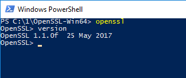

1. You should see the openssl prompt - this means the install worked successfully.

# Overview

**This tutorial uses ****MongoDB version ****3.4**

The full exercise will be done in 3 steps:

1. Creation of a self-signed x.509 certificate

2. Addition of a user (with the same credentials as the x.509 cert)

3. Logging in into mongo using the certificate

# Creating a self-signed x.509 certificate

Typically a certificate would be provided by a certifying authority, however for the purposes of development, we’ll create our own i.e. self-signed certificate.

Creating the x.509 certificate requires the following steps:

1. Configure OpenSSL to create mongodb friendly certificates

2. First create the identity for the Certificate Authority (the root organization that’ll verify everyone’s identity)

    1. Create the root private key and certificate 

3. Create the identity for the individual user

    2. Create the private key and generate a certificate signing request (a user can’t create it’s own certificate, it must be verified by a Certificate Authority)

    3. Create the certificate

4. Merge the certificate and the private key into a single pem file

5. Validate the certificate to make sure everything is fine

Let’s carry these out step-by-step:

## Configure OpenSSL

For MongoDB to work with x.509 certificates, the following conditions need to be satisfied:

* A single Certificate Authority (CA) must issue the certificates for both the client and the server.

* Client certificates must contain the following fields:

    * `keyUsage = digitalSignature`

    * `extendedKeyUsage = clientAuth`

* Each unique MongoDB user must have a unique certificate.

There’s other conditions too but this is our focus for now. Let’s set `keyUsage` and `extendedKeyUsage` fields.

1. Optional: You may want to add `[OpenSSL install location]\bin` to your Environment Variables’ Path variable. For e.g. in my case OpenSSL is installed in `C:\1\OpenSSL-Win64` so I have added `C:\1\OpenSSL-Win64\bin` to my Path.

2. Navigate to the directory where OpenSSL is installed, go into the folder called ‘bin’ and make a copy of `openssl.cfg`. Call this `openssl_mongo.cfg`. 
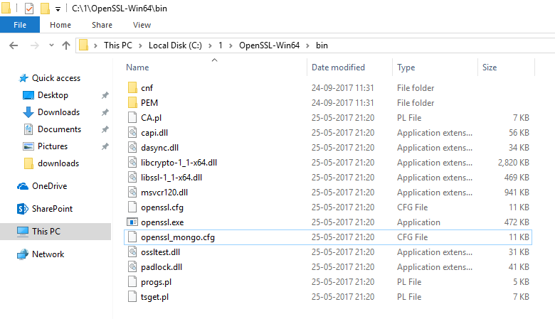

3. Edit openssl_mongo.cfg and search for the configuration section titled: 
`[ usr_cert ]` 
Add the following lines in this section:
```
# added for mongoDB
keyUsage = keyCertSign, digitalSignature
extendedKeyUsage = clientAuth, serverAuth
```
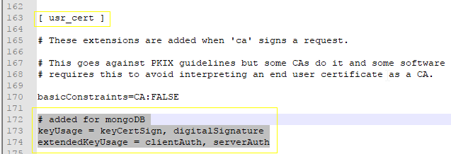

4. In the sections titled:
`[ v3_ca ]` and 
`[ v3_req ]`
Add the following lines:
```
# added for mongoDB
extendedKeyUsage = clientAuth, serverAuth
```

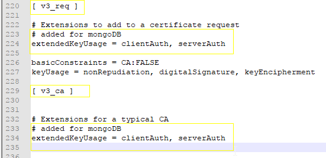

5. Save & close `openssl_mongo.cfg` and move it to a directory where we’ll create our certificates. In my case I moved it to a folder called mongocerts
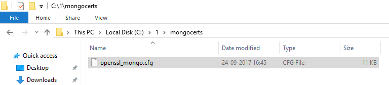

You are now ready to start making the certificates.

## Certificate Authority’s private key and certificate

### Key

To create the private key, use the following command:

`openssl genrsa -out myPrivate.key -aes256`

The system will ask for a passphrase, I used: `1234` 

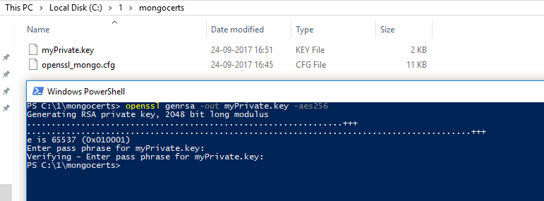

Notice that the system creates a .key file. If you were to open this in a text editor, you’ll realize that it’s a plain text file.

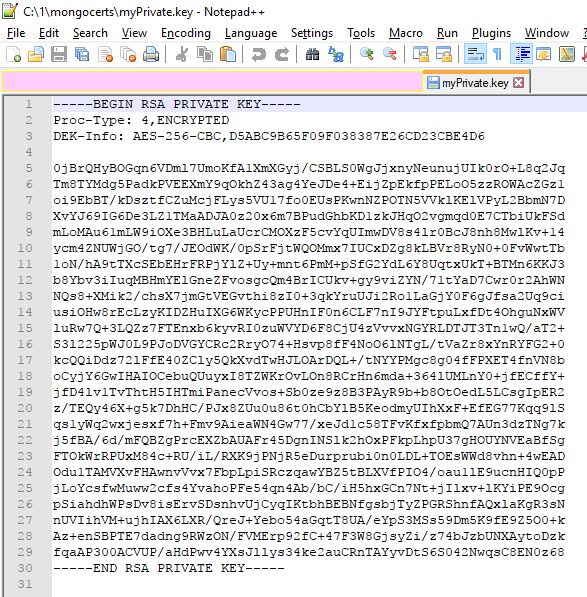

Cool!

On to creating the root certificate. 

### Certificate

Use the following command.

`openssl req -x509 -new -extensions v3_ca -key myPrivate.key -days 1000 -out my.crt`

The system will ask you to enter the passphrase for the key (which is `1234` if you used the same one as me) and then ask a bunch of questions to make the certificate. 
The values that you enter here are combined to create the "Distinguished Name" of your certificate. *Remember these values.*

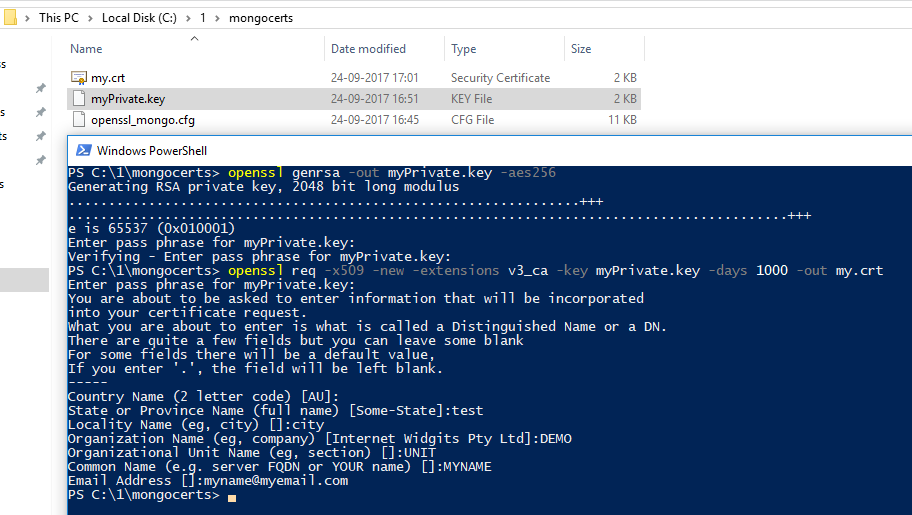

Here are the values that I used:

* Country Name - `AU`

* State or Province name - `test`

* Locality name - `city`

* Organization name - `DEMO`

* Organizational unit name - `UNIT`

* Common Name - `MYNAME`

* Email Address -`myname@myemail.com`

Feel free to use the ones you like.  Again, open the certificate in a text editor - you’ll realize that this is a plain text file too!

With our root certifying authority creds ready, our certifying authority is ready to sign any end-user’s identity. Let’s move on to creating a certificate signing request.

## User’s Key and Certificate Signing Request

We’ll use a single command to create both the key and the CSR for a user.

Try the following in the command window next:

```
openssl req -new -nodes -newkey rsa:2048 -keyout user.key -out user.csr
```

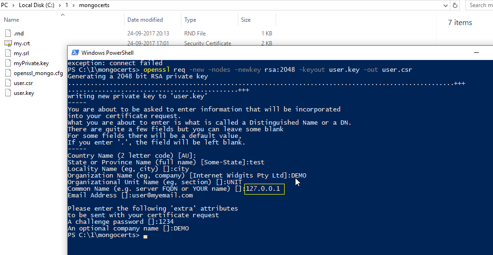

We now have the user key and CSR. Assuming you are running the whole shebang from your localhost, make sure you put common name (CN) to be `127.0.0.1` otherwise put the relevant IP of the Mongodb server here - when authenticating, the CN should match the IP of the server.

Here are the values that I used when creating these:

* Country Name: `AU`

* State or Province Name:`test`

* Locality Name:`city`

* Organization Name:`DEMO`

* Organizational Unit Name:`UNIT`

* Common Name:`127.0.0.1`

* Email Address:`user@myemail.com`

* The 'extra' attributes

    * A challenge password:`1234`

    * An optional company name:`DEMO`

Again, *remember these values, *they form the "Distinguished Name" of your user’s certificate. The key and certificate signing request are both plain text files, just like the others that were created before.

We are getting close. Let’s create the x.509 certificates for our user.

## User’s X.509 certificate from CSR

To generate the public certificate, use the following command:

```

openssl x509 -CA my.crt -CAkey myPrivate.key -CAcreateserial -req -days=1000 -in user.csr -out user.crt

```

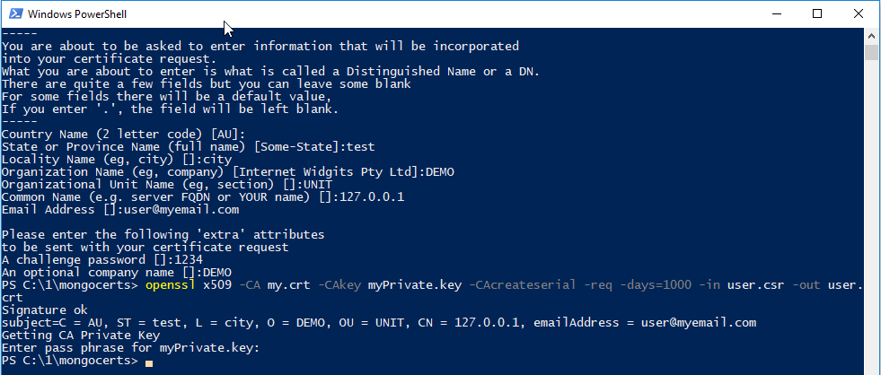

Perfect. Now to make it usable, we want to bundle the certificate and the key in a single file. By the way, before we go there, what kind of file would the final certificate be? Text, plain text. :)

## Merge the user’s key & cert

The format we’ll merge this to is called PEM (Privacy Enhanced Mail). As with all other certificates and keys that we have generated till now, this is a plain text file too. Creating this is super simple. Use concatenation, or from the windows command-line, use `copy`, like so:

```

 copy user.key + user.crt user.pem

```

However, if you are using powershell, the plain old `copy` may not work, in which case, use:

```

cmd /c copy user.key + user.crt user.pem

```

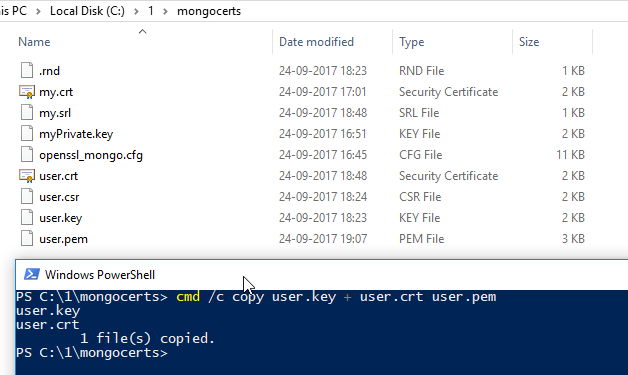

Some of you may point out that we could’ve used the [get-content commandlet](https://docs.microsoft.com/en-us/powershell/module/Microsoft.PowerShell.Management/Get-Content?view=powershell-5.1) in Powershell. Sure! Feel free to use it instead. 

## Certificate validation

Whew! Nearly there!

Our certificate is mint fresh and just to be sure, we’d want to verify it *against the certificate authority*. Use the following command:

```

openssl verify -verbose -CAfile my.crt user.pem

```

Now, let’s check out the subject line (aka the ‘Distinguished Name’) of our certificate, we’ll use this to create a user in Mongo, so keep a note of it. Run the following command:

```

openssl x509 -in user.pem -inform PEM -subject -nameopt RFC2253

```

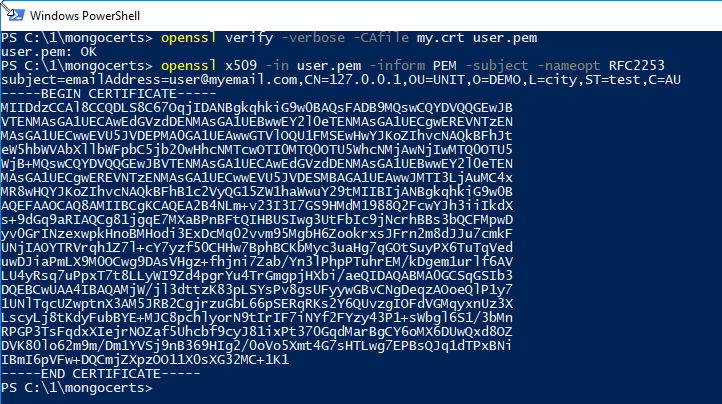

Brilliant! Our self-signed certificate is ready to go.

# Add a user to Mongodb 

Before we enable authentication, we now need to add a user to MongoDB.

1. Open two command-line/ powershell windows, in one fire:
`mongod`

2. This should start the MongoDB server. (Ensure that the folder `C:\data\db` exists, this is where Mongodb will store its data by default)

3. In the other  window, fire:
`mongo`

4. You should enter the mongo shell. 

5. Now run the following command to add the user (notice that there are no spaces in the `subject` - it exists as it was copied from the user’s certificate)

```

db.getSiblingDB("$external").runCommand(
  {
    createUser: "emailAddress=user@myemail.com,CN=127.0.0.1,OU=UNIT,O=DEMO,L=city,ST=test,C=AU",
    roles: [
             { role: 'readWrite', db: 'test' },
             { role: 'userAdminAnyDatabase', db: 'admin' }
           ],
    writeConcern: { w: "majority" , wtimeout: 5000 }
  }
)

```

1. If the user got added successfully, you should see `{ "ok" : 1 }
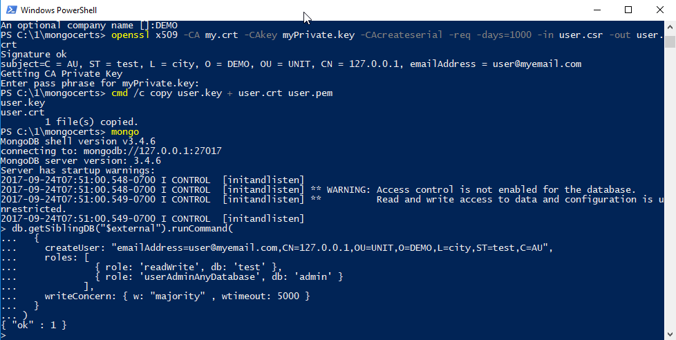

2. Type `exit` to exit the mongo client, move to the mongod window and hit `CTRL+C` to shut down the mongod server.

On to the last leg.

# Using X.509 to login

This is the simple bit. We’ll first start the mongod server with ssl enabled and then login using the mongo client. Once in, we’ll authenticate our user using the subject line.

1. Start `mongod` with SSL enabled:
```
mongod --clusterAuthMode x509 --sslMode requireSSL --sslPEMKeyFile "C:\1\mongocerts\user.pem" --sslCAFile "C:\1\mongocerts\my.crt"
```
Notice that I am using the paths relevant to my system, replace these with the paths that you have chosen to store the certificates in on your system.
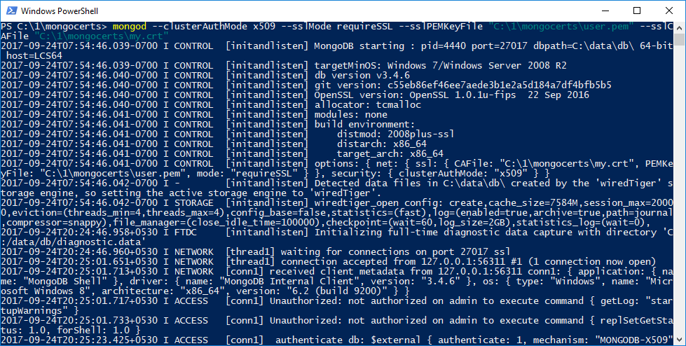
`mongod` should start.

2. In another command / powershell window, use the following command to start the `mongo` client:
```
mongo --ssl --sslPEMKeyFile "C:\1\mongocerts\user.pem" --sslCAFile "C:\1\mongocerts\my.crt"
```
Again, remember to tweak the paths to reflect the location of the certificates on your system. 

3. Once `mongo` client starts, use the following command to authenticate our user:
```
db.getSiblingDB("$external").auth(
  {
    mechanism: "MONGODB-X509",
    user: "emailAddress=user@myemail.com,CN=127.0.0.1,OU=UNIT,O=DEMO,L=city,ST=test,C=AU"
  }
)
```
Remember to mark the mechanism as `"MONGODB-X509”`
If all goes well, the user should now be authenticated and you should see `1` as the output.
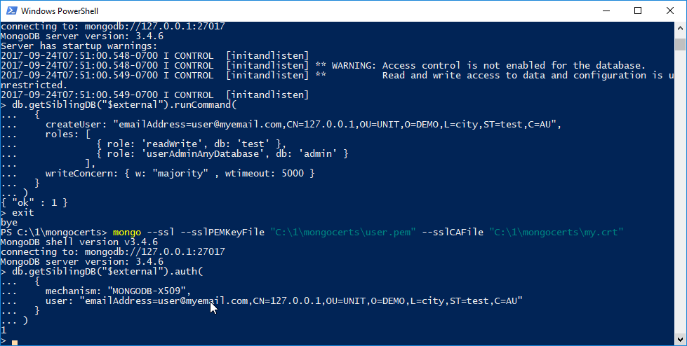

There, You are now logged into Mongodb using X.509 certificate authentication.

*Sweet!*

# Read more 

* The OpenSSL Cookbook: 
[https://www.feistyduck.com/library/openssl-cookbook/online/](https://www.feistyduck.com/library/openssl-cookbook/online/)

* Awesome cryptography: 
[https://github.com/sobolevn/awesome-cryptography](https://github.com/sobolevn/awesome-cryptography) 

# Who me?

github.com/shauryashaurya
shauryashaurya@gmail.com
[www.linkedin.com/in/shauryashaurya/](www.linkedin.com/in/shauryashaurya/)

