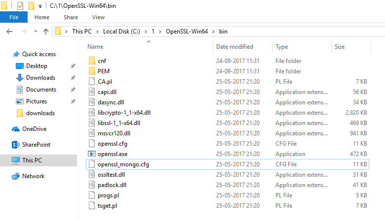
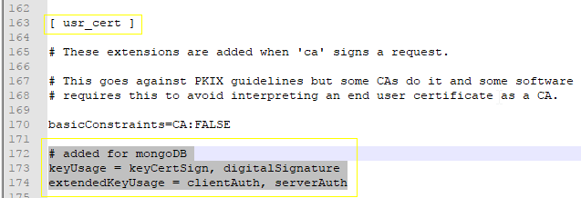
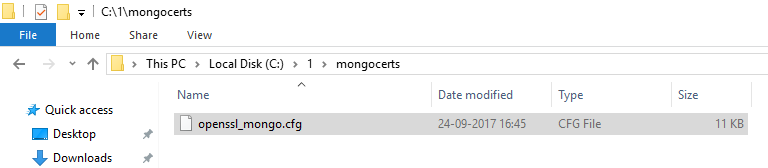
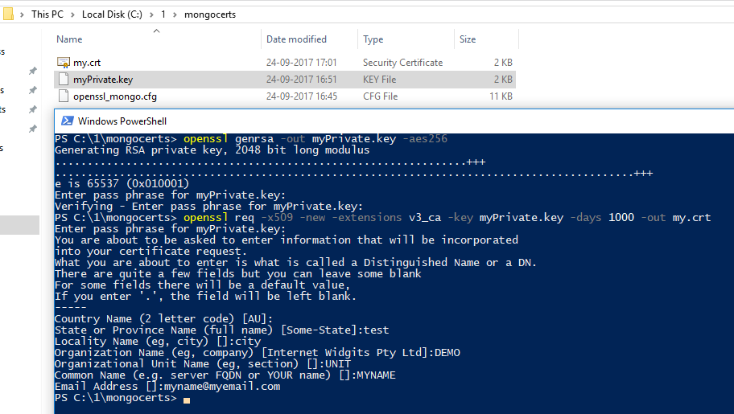

**X.509** certificates for user authentication in **MongoDB**

specific to windows 10

*Reference: A similar tutorial is available in the MongoDB documentation:*

*[https://docs.mongodb.com/manual/tutorial/configure-x509-client-authentication*/](https://docs.mongodb.com/manual/tutorial/configure-x509-client-authentication/)

# Prep-work

We’d need to install OpenSSL for windows first. 

OpenSSL does not provide a binary for windows, however one is available from:

[https://slproweb.com/products/Win32OpenSSL.html](https://slproweb.com/products/Win32OpenSSL.html)

We’ll use the 64-bit version listed towards the bottom of this page. Look for the words "Win64 OpenSSL" and download the full package (not the ‘lite’ or ‘light’ package). 

1. Install the downloaded package (you may need administrative privileges).

2. Once installed, open a command window and type:

openssl

1. You should see the openssl prompt - this means the install worked successfully.

# Overview

**This tutorial uses ****MongoDB version ****3.4**

The full exercise will be done in 3 steps:

1. Creation of a self-signed x.509 certificate

2. Addition of a user (with the same credentials as the x.509 cert)

3. Logging in into mongo using the certificate

# Creating a self-signed x.509 certificate

Typically a certificate would be provided by a certifying authority, however for the purposes of development, we’ll create our own i.e. self-signed certificate.

Creating the x.509 certificate requires the following steps:

1. Configure OpenSSL to create mongodb friendly certificates

2. Create the root private key and certificate

3. Create the public certificate signing request

4. Create the certificate

5. Merge the certificate and the private key into a single pem file

6. Validate the certificate to make sure everything is fine

Let’s carry these out step-by-step:

## Configure OpenSSL

For MongoDB to work with x.509 certificates, the following conditions need to be satisfied:

* A single Certificate Authority (CA) must issue the certificates for both the client and the server.

* Client certificates must contain the following fields:

    * keyUsage = digitalSignature

    * extendedKeyUsage = clientAuth

* Each unique MongoDB user must have a unique certificate.

There’s other conditions too but this is our focus for now. Let’s set keyUsage and extendedKeyUsage fields.

1. Optional: You may want to add [OpenSSL install location]\bin to your Environment Variables’ Path variable. For e.g. in my case OpenSSL is installed in C:\1\OpenSSL-Win64 so I have added C:\1\OpenSSL-Win64\bin to my Path.

2. Navigate to the directory where OpenSSL is installed, go into the folder called ‘bin’ and make a copy of openssl.cfg. Call this openssl_mongo.cfg. 

3. Edit openssl_mongo.cfg and search for the configuration section titled: 
[ usr_cert ] 
Add the following lines in this section:
# added for mongoDB
keyUsage = keyCertSign, digitalSignature
extendedKeyUsage = clientAuth, serverAuth

4. In the sections titled:
[ v3_ca ] and 
[ v3_req ]
Add the following lines:
# added for mongoDB
extendedKeyUsage = clientAuth, serverAuth


5. Save & close openssl_mongo.cfg and move it to a directory where we’ll create our certificates. In my case I moved it to a folder called mongocerts

You are now ready to start making the certificates.

## Creating the private key and certificate

### Key

To create the private key, use the following command:

openssl genrsa -out myPrivate.key -aes256

The system will ask for a pass phrase, I used: 1234 

Notice that the system creates a .key file. If you were to open this in a text editor, you’ll realize that it’s a plain text file.

Cool!

On to creating the root certificate. 

### Certificate

Use the following command.

openssl req -x509 -new -extensions v3_ca -key myPrivate.key -days 1000 -out my.crt

The system will ask you to enter the passphrase for the key (which is 1234 if you used the same one as me) and then ask a bunch of questions to make the certificate. 
The values that you enter here are combined to create the "Distinguished Name" of your certificate. *Remember these values.*

Here are the values that I used:

* Country Name - AU

* State or Province name - test

* Locality name - city

* Organization name - DEMO

* Organizational unit name - UNIT

* Common Name - MYNAME

* Email Address - myname@myemail.com

Feel free to use the ones you like. Remember to note these values down - they’re going to be useful shortly.

